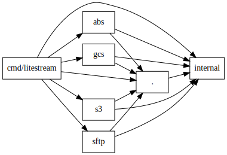
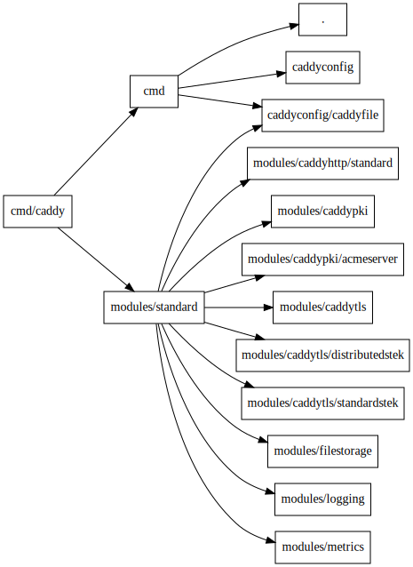

# Imports

`imports` is a CLI tool that generates a dependency graph of the internal imports of a Go project.

## Prerequisites

- [Graphviz](https://graphviz.org)
  - Debian: `apt install graphviz`
  - macOS: `brew install graphviz`

## Usage

### Pick-up a Go project

```
git clone https://github.com/benbjohnson/litestream.git
cd litestream
```

### Generate graph

```
go list ./cmd/litestream
go run github.com/xpetit/imports@latest ./cmd/litestream > litestream.gv
dot -O -Tsvg litestream.gv
```

The resulting file [litestream.gv.svg](litestream.gv.svg) :


### Depth

You can limit the depth for projects with bigger import graphs:

```
git clone https://github.com/caddyserver/caddy.git
cd caddy
go list ./cmd/caddy
go run github.com/xpetit/imports@latest -depth 2 ./cmd/caddy > caddy.gv
dot -O -Tsvg caddy.gv
```

The resulting file [caddy.gv.svg](caddy.gv.svg) :

